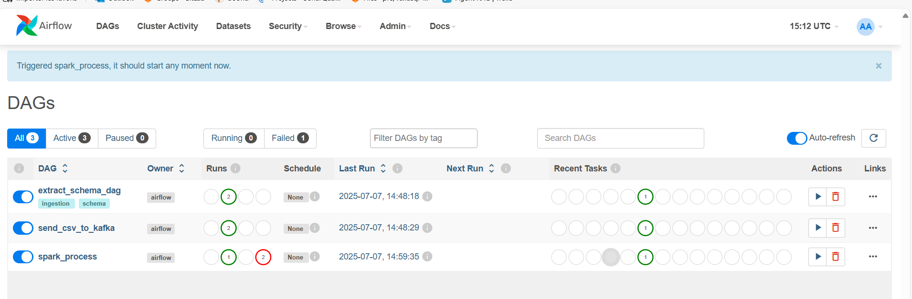
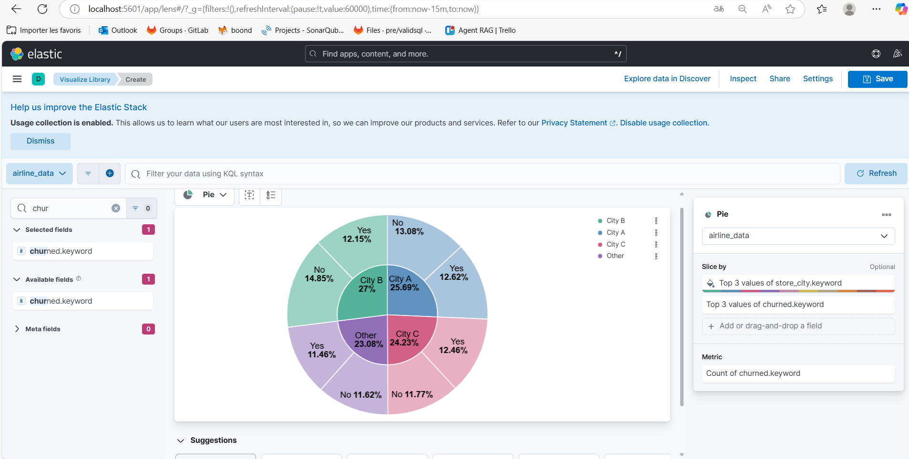
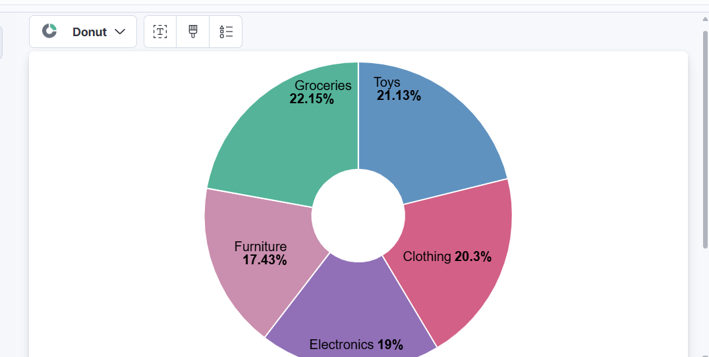
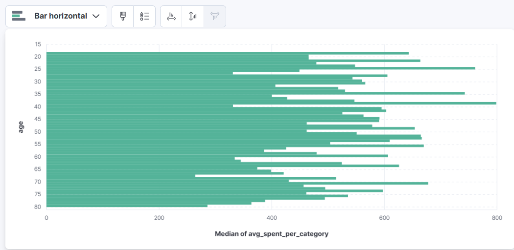
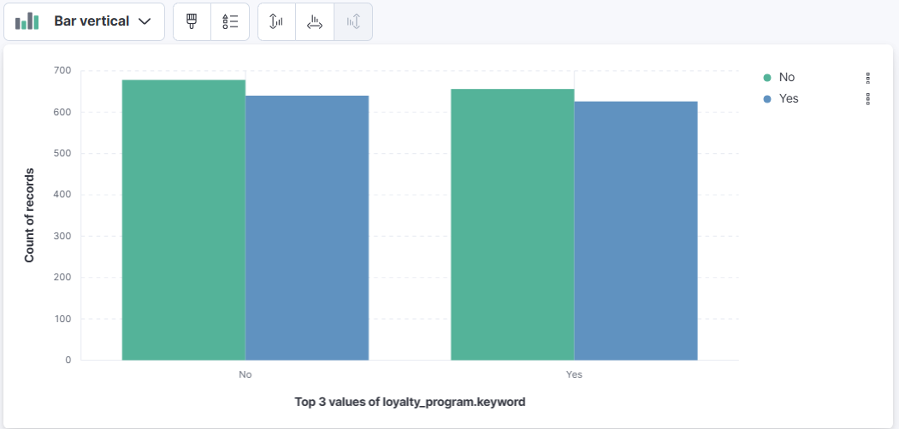
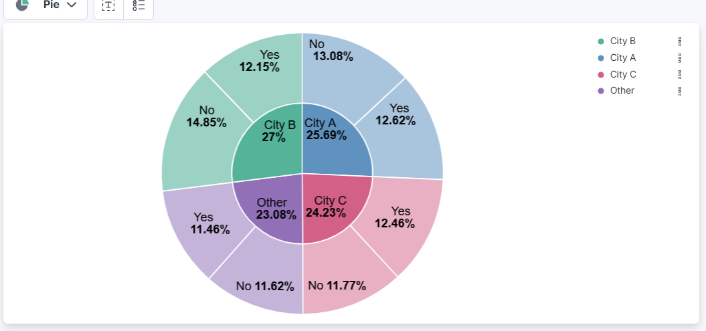

# Retail Data Big Data Pipeline

A scalable, real-time analytics pipeline for processing and visualizing synthetic retail transaction data, utilizing Apache Kafka, Spark, Airflow, Elasticsearch, and Kibana—all orchestrated with Docker Compose.

---

## 🛠 Technologies Used

- **Apache Airflow** – Manages ETL workflows via DAGs.
- **Apache Kafka** – Streams CSV data in real time.
- **Apache Spark** – Performs distributed data processing and transformation.
- **Elasticsearch** – Indexes and stores raw and processed data for search.
- **Kibana** – Enables dashboards and data visualization.
- **Docker Compose** – Simplifies local development and service orchestration.

---

## 🔍 Project Overview

This solution provides a robust, end-to-end big data pipeline for ingesting, transforming, and visualizing retail transaction data, empowering actionable business insights through interactive dashboards.

---

## 📦 Architecture

CSV File → Kafka → Spark (Transform & Aggregate) → Elasticsearch → Kibana  
            ↑  
        Ingested by Airflow DAGs

---

## 📦 Dataset Schema

| Column Name                | Description                                                      |
|----------------------------|------------------------------------------------------------------|
| customer_id                | Unique customer identifier                                        |
| age                        | Customer age                                                     |
| gender                     | Customer gender                                                  |
| income_bracket             | Income category (e.g., Low, Medium, High)                        |
| loyalty_program            | Indicates loyalty program membership (Yes/No)                    |
| membership_years           | Years in loyalty program                                          |
| churned                    | Indicates if the customer has churned (Yes/No)                   |
| marital_status             | Marital status                                                   |
| number_of_children         | Number of children                                               |
| education_level            | Highest education attained                                       |
| occupation                 | Customer occupation                                              |
| transaction_id             | Unique transaction identifier                                    |
| transaction_date           | Date and time of transaction                                     |
| product_id                 | Unique product identifier                                        |
| product_category           | Product category (e.g., Electronics, Clothing)                   |
| quantity                   | Number of items purchased                                        |
| unit_price                 | Price per item                                                   |
| discount_applied           | Discount applied to transaction                                  |
| payment_method             | Payment method (e.g., Credit Card, Cash)                         |
| store_location             | Store location name                                              |
| transaction_hour           | Hour of transaction                                              |
| day_of_week                | Day of the week                                                  |
| week_of_year               | Week number                                                      |
| month_of_year              | Month number                                                     |
| avg_purchase_value         | Customer's average purchase value                                |
| purchase_frequency         | Frequency of purchases (e.g., Daily, Weekly)                     |
| last_purchase_date         | Date of last purchase                                            |
| avg_discount_used          | Average discount used by customer                                |
| preferred_store            | Customer's preferred store location                              |
| online_purchases           | Number of online purchases                                       |
| in_store_purchases         | Number of in-store purchases                                     |
| avg_items_per_transaction  | Average items per transaction                                    |
| avg_transaction_value      | Average value per transaction                                    |
| total_returned_items       | Total items returned                                             |
| total_returned_value       | Total value of returned items                                    |
| total_sales                | Total sales value                                                |
| total_transactions         | Total number of transactions                                     |
| total_items_purchased      | Total items purchased                                            |
| total_discounts_received   | Total discounts received                                         |
| avg_spent_per_category     | Average spent per product category                               |
| max_single_purchase_value  | Maximum value of a single purchase                               |
| min_single_purchase_value  | Minimum value of a single purchase                               |
| product_name               | Name of the product                                              |
| product_brand              | Brand of the product                                             |
| product_rating             | Product rating                                                   |
| product_review_count       | Number of product reviews                                        |
| product_stock              | Product stock level                                              |
| product_return_rate        | Product return rate                                              |
| product_size               | Product size                                                     |
| product_weight             | Product weight                                                   |
| product_color              | Product color                                                    |
| product_material           | Product material                                                 |
| product_manufacture_date   | Product manufacture date                                         |
| product_expiry_date        | Product expiry date                                              |
| product_shelf_life         | Product shelf life (days)                                        |
| promotion_id               | Promotion identifier                                             |
| promotion_type             | Type of promotion (e.g., Flash Sale, 20% Off)                   |
| promotion_start_date       | Promotion start date                                             |
| promotion_end_date         | Promotion end date                                               |
| promotion_effectiveness    | Effectiveness of promotion (e.g., High, Medium, Low)             |
| promotion_channel          | Channel used for promotion (e.g., Online, In-store)              |
| promotion_target_audience  | Target audience for promotion                                    |
| customer_zip_code          | Customer's zip code                                              |
| customer_city              | Customer's city                                                  |
| customer_state             | Customer's state                                                 |
| store_zip_code             | Store's zip code                                                 |
| store_city                 | Store's city                                                     |
| store_state                | Store's state                                                    |
| distance_to_store          | Distance from customer to store                                  |
| holiday_season             | Indicates holiday season purchase (Yes/No)                       |
| season                     | Season of the year (e.g., Winter, Summer)                        |
| weekend                    | Indicates weekend purchase (Yes/No)                              |
| customer_support_calls     | Number of customer support calls                                 |
| email_subscriptions        | Email subscription status (Yes/No)                               |
| app_usage                  | App usage frequency (e.g., High, Medium, Low)                    |
| website_visits             | Number of website visits                                         |
| social_media_engagement    | Social media engagement level (e.g., High, Medium, Low)          |
| days_since_last_purchase   | Days since last purchase                                         |

---

## Pipeline Steps

1. **Schema Extraction**: `scripts/extract_schema.py` infers the schema from the CSV and generates a JSON schema file.
2. **Kafka Topic Creation**: `scripts/create_kafka_topic.py` sets up the required Kafka topic.
3. **CSV Ingestion**: `airflow/dags/ingest_csv_to_kafka.py` streams CSV rows into Kafka.
4. **Spark Processing**: `scripts/process_with_spark.py` reads from Kafka, parses and processes the data using the inferred schema, performs aggregations (e.g., average unit price by product category), and indexes both raw and aggregated data into Elasticsearch.
5. **Visualization**: Kibana is used to build dashboards and visualizations from Elasticsearch indices.

---

### Example Pipeline Runs

**Airflow DAG Run – All Tasks Succeeded:**



**Elasticsearch and Kibana Services Running:**



---

## Running the Pipeline

1. **Clone the repository**
2. **Configure the environment**
   - Adjust `docker-compose.yml` for your ports and volumes.
   - Place your dataset in `data/retail_data.csv`.
3. **Build and launch the stack**
   ```sh
   docker compose down
   docker compose build
   docker compose up -d
   ```
4. **Access services**
   - Airflow: http://localhost:8080
   - Kibana: http://localhost:5601
   - (Kafka, Spark, and Elasticsearch run as services in the stack)
5. **Execute the pipeline**
   - Use the Airflow UI to trigger DAGs in sequence: schema extraction, topic creation, ingestion, processing.
   - Monitor logs in Airflow and Spark for progress.
6. **Visualize in Kibana**
   - Create a data view (index pattern) for your Elasticsearch index (e.g., `retail_data` or `retail_data_raw`).
   - Use Discover and Visualize to explore and chart your data.

---

## Visualization Samples

Below are sample Kibana visualizations generated from the processed retail data.





---

## Customer Analysis Visualizations

Gain insights into customer behavior and churn with these visualizations:

- **Churn by Loyalty Program:**

  

  *Description:*  
  This vertical bar chart shows the relationship between customer churn and loyalty program membership. The X-axis indicates loyalty program participation (Yes/No), while the Y-axis shows record counts. Each bar is split by churn status, allowing comparison of churned and non-churned customers within each group. This helps assess the impact of loyalty programs on retention.

- **Churn by City:**

  

  *Description:*  
  This sunburst pie chart illustrates customer churn distribution across cities. The inner ring represents cities (e.g., City A, City B, City C, Other), and the outer ring splits each city by churn status (Yes/No). Percentage labels indicate each group's share of the total customer base, helping identify cities with higher or lower churn rates.

---

## File Structure

```
docker-compose.yml
airflow/
    Dockerfile
    requirements.txt
    dags/
        extract_schema_dag.py
        ingest_csv_to_kafka.py
        process_with_spark_dag.py
    ...
data/
    retail_data.csv
    output_es/
kafka/
    entrypoint.sh
    kafka.properties
scripts/
    create_kafka_topic.py
    extract_schema.py
    process_with_spark.py
version/
    DVM_retail_data_v1.json
```

---

## Customization

- To modify aggregation or processing logic, edit `scripts/process_with_spark.py`.
- To use a different dataset, place your CSV in `data/` and rerun schema extraction.
- To add new visualizations, use Kibana’s dashboard features.

---

## ⚙️ System Requirements

- Docker v20.10+
- Docker Compose v2+
- Python 3.8+ (for running scripts locally)
- WSL2 (Windows) or native Linux/macOS recommended
- (Optional) Python 3.x for local script execution

---

## Installation / Prerequisites

Before starting, ensure you have the following installed:

- **Docker** (20.10+ recommended)
- **Docker Compose** (v2+ recommended, or included with Docker Desktop)
- **Python** (3.8 or higher, only for local scripts)
- **Git** (for cloning the repository)

### System Requirements

- Minimum **8 GB RAM** (16 GB recommended for large datasets or multiple services)
- At least **4 CPU cores** recommended
- **10+ GB free disk space** for Docker images, data, and logs

#### Example System Specs

- **Processor:** 13th Gen Intel(R) Core(TM) i5-13420H @ 2.10 GHz (8 cores)
- **RAM:** 24 GB (23.7 GB usable)
- **System Type:** 64-bit OS, x64-based processor

These specs are sufficient for running the full pipeline, even with large datasets and multiple Docker services.

#### Windows Users

- It is highly recommended to use **WSL 2 (Windows Subsystem for Linux)** with Docker Desktop for optimal compatibility and performance.
- Enable WSL 2 integration in Docker Desktop settings.
- All commands in this README can be run from a WSL terminal (Ubuntu or other supported Linux distros).

#### Additional Notes

- Ensure virtualization is enabled in BIOS/UEFI for Docker.
- On Mac, use Docker Desktop and set resource limits appropriately.
- For Linux, install Docker and Docker Compose via your distribution’s package manager or the official Docker instructions.

---

## Credits

- Built with Apache Airflow, Kafka, Spark, Elasticsearch, and Kibana.
- Dataset is synthetic and intended for demonstration purposes only.

